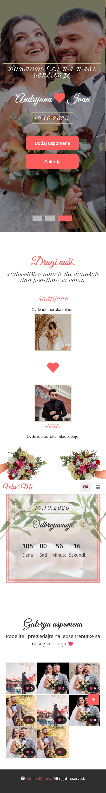
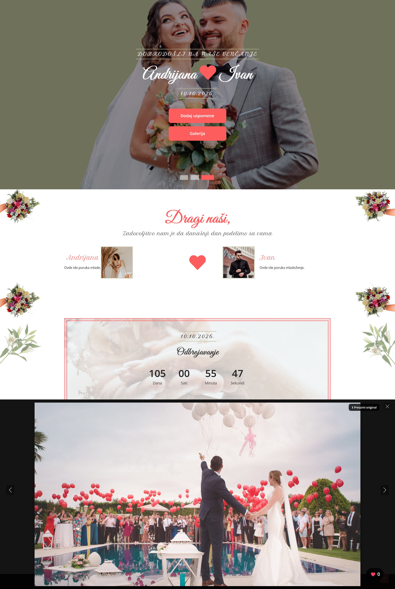
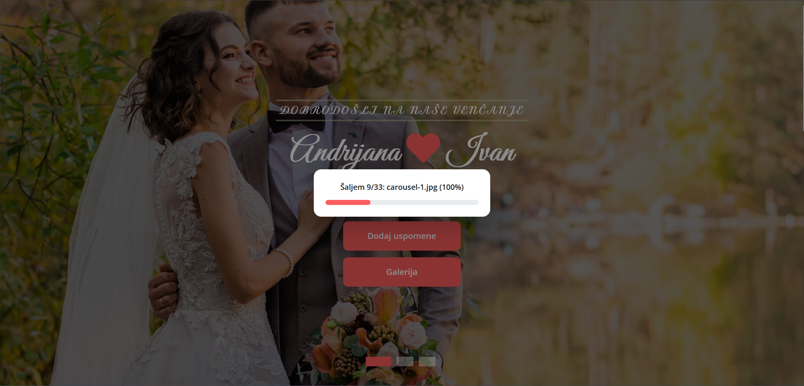
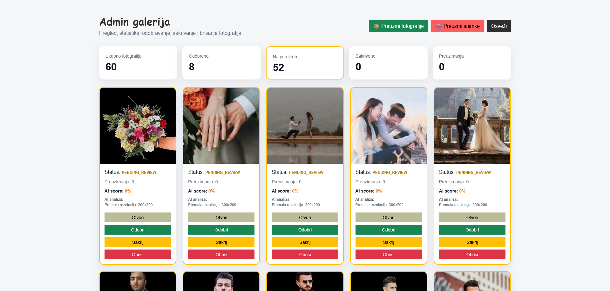

# Wedding Photo Sharing Platform

<p align="center">
  
</p>

<p align="center">


</p>

A production-oriented, self-hosted web application that enables wedding guests to upload, browse, like, and download photos and videos through a modern, responsive interface.

The platform is built with **Node.js**, **Express**, **TypeScript**, and **SQLite**, and is deployed on an **Ubuntu Server** behind an **Nginx reverse proxy**, with **Cloudflare DNS** and **Let's Encrypt HTTPS**.

The project includes:

- Image and video uploads
- AI-powered image moderation
- Background media-processing queues
- Administrator moderation tools
- Automated local and remote backups
- Windows-based point-in-time snapshots
- Load and stress testing
- OWASP ZAP security testing
- A tested Disaster Recovery procedure

> **Note**
>
> Screenshots and example files included in this repository use demonstration content only.

---

# Features

## Guest Features

- Upload multiple photos and videos
- Upload progress indication
- Responsive mobile-first interface
- Public media gallery
- Paginated and incremental gallery loading
- Lazy-loaded thumbnails
- Full-screen image preview
- Browser-compatible video playback
- Download original media
- Like system with per-client tracking
- Wedding countdown
- QR-code-friendly access
- Multi-language support:
  - 🇷🇸 Serbian
  - 🇬🇧 English
  - 🇩🇪 German

---

## Administration

- Password-protected administrator panel
- Session-based authentication
- bcrypt password hashing
- Administrator login rate limiting
- Media statistics dashboard
- View approved, hidden, and pending media
- Approve uploaded media
- Hide uploaded media
- Delete uploaded media
- Review AI moderation results
- Download all photos as a ZIP archive
- Download all videos as a ZIP archive
- Email notifications for media requiring review

---

## Image Processing

Uploaded images are processed using **Sharp**.

Implemented processing includes:

- EXIF orientation correction
- Automatic image rotation
- Thumbnail generation
- JPEG optimization
- Resolution validation
- Blur detection
- AI moderation
- Automatic moderation status assignment
- Background queue processing

---

## Video Processing

Uploaded videos are processed using **FFmpeg**.

Implemented processing includes:

- Original video storage
- Background video-processing queue
- Browser-compatible web video generation
- H.264 transcoding
- Video scaling and optimization
- Video thumbnail generation
- Sequential FIFO processing
- Database status updates
- Email notification for manual review
- Logging of queue start, completion, and errors

Video processing is performed asynchronously so that large video files do not block new uploads or gallery requests.

---

## AI Moderation

AI image moderation is implemented using:

- TensorFlow.js
- NSFWJS
- Sharp-based blur detection

Images are evaluated using the following categories:

- Neutral
- Drawing
- Hentai
- Porn
- Sexy

The moderation pipeline also checks:

- Minimum image resolution
- Blur score
- AI confidence thresholds

Depending on the result, media is assigned one of the following statuses:

- `approved`
- `pending_review`
- `hidden`

---

# Media Processing Pipeline

```text
                        Client Upload
                              │
                              ▼
                      Rate Limit Check
                              │
                              ▼
                  File Type and Size Validation
                              │
                              ▼
                      Original File Storage
                              │
             ┌────────────────┴─────────────────┐
             │                                  │
             ▼                                  ▼
        Image Queue                         Video Queue
             │                                  │
             ▼                                  ▼
    EXIF Rotation / Sharp               FFmpeg Transcoding
             │                                  │
             ▼                                  ▼
     Thumbnail Generation                Video Thumbnail
             │                                  │
             ▼                                  ▼
      Blur Detection                    Web Video Version
             │                                  │
             ▼                                  │
      NSFWJS Moderation                         │
             └────────────────┬─────────────────┘
                              ▼
                       SQLite Database
                              │
                              ▼
                    Administrator Review
                              │
                              ▼
                       Public Gallery
```

---

# Architecture

```text
                           Internet
                               │
                        Cloudflare DNS
                               │
                         HTTPS / TLS
                               │
                      Nginx Reverse Proxy
                               │
             ┌─────────────────┴──────────────────┐
             │                                    │
             ▼                                    ▼
       Static Frontend                     Express Backend
                                                  │
                     ┌────────────────────────────┼──────────────────────────┐
                     │                            │                          │
                     ▼                            ▼                          ▼
              SQLite Database              Upload Storage             Processing Queues
                     │                            │                          │
                     │                    ┌───────┴────────┐          ┌──────┴──────┐
                     │                    ▼                ▼          ▼             ▼
                     │                 Images           Videos      Sharp        FFmpeg
                     │
                     └────────────────────────────┬───────────────────────────────┘
                                                  ▼
                                         AI Image Moderation
                                                  │
                                                  ▼
                                           Public Gallery
```

---

# Technology Stack

| Category | Technologies |
|---|---|
| Backend | Node.js, Express 5, TypeScript |
| Frontend | HTML5, CSS3, JavaScript, Bootstrap |
| Database | SQLite, better-sqlite3 |
| Image Processing | Sharp |
| Video Processing | FFmpeg |
| Upload Handling | Multer |
| Archive Creation | Archiver |
| AI Moderation | TensorFlow.js, NSFWJS |
| Authentication | express-session, bcrypt |
| Security | express-rate-limit, CSP, HSTS, secure cookies |
| Web Server | Nginx |
| Operating System | Ubuntu Server |
| DNS and TLS | Cloudflare DNS, Let's Encrypt, Certbot |
| Backup | Bash, rsync, SQLite `.backup`, SSH |
| Windows Integration | OpenSSH for Windows, MSYS2, rsync |
| Containers | Docker, Portainer |
| Testing | curl, Autocannon, OWASP ZAP, ffprobe |
| Monitoring | systemd, journalctl, Netdata, custom Bash scripts |
| Development | Git, GitHub, Visual Studio Code |

---

# Database

The application uses SQLite with:

- WAL journal mode
- `synchronous = NORMAL`
- Busy timeout configuration
- Transactional writes
- Database integrity checks
- SQLite-native backup operations

## `photos`

Stores:

- Filename
- Original URL
- Thumbnail URL
- Browser-compatible video URL
- Upload timestamp
- Media type
- Moderation status
- AI score
- AI reason
- View count
- Download count
- Like count

## `photo_likes`

Stores per-client likes and prevents duplicate likes through a unique constraint.

## `admins`

Stores administrator usernames and bcrypt password hashes.

---

# Storage Structure

```text
wedding-app/
├── backend/
├── frontend/
├── database.sqlite
└── uploads -> /srv/Media/wedding-uploads

/srv/Media/wedding-uploads/
├── original/
├── thumbs/
└── videos/
    ├── original/
    ├── thumbs/
    └── web/
```

The application directory contains a symbolic link to media storage located on a separate disk.

This allows:

- Application code to remain on the system SSD
- Large media files to be stored on a dedicated media disk
- Easier backup and recovery
- Simpler storage expansion

---

# Security

The platform includes several application and infrastructure security controls.

## HTTPS and Transport Security

- HTTPS using Let's Encrypt
- HTTP-to-HTTPS redirect
- HSTS
- Secure cookies in production
- HttpOnly session cookies
- SameSite cookie protection
- Nginx TLS termination
- Cloudflare DNS

## HTTP Security Headers

Configured through Nginx:

- `Content-Security-Policy`
- `Strict-Transport-Security`
- `X-Frame-Options`
- `X-Content-Type-Options`
- `Referrer-Policy`
- `Permissions-Policy`
- `Cross-Origin-Opener-Policy`
- `Cross-Origin-Resource-Policy`

## Application Security

- Express `x-powered-by` disabled
- Restricted CORS origins
- Upload request rate limiting
- Administrator login rate limiting
- bcrypt password hashing
- Session-based authentication
- Protected administrator routes
- File extension validation
- MIME type validation
- File size validation
- Common exploit and scanner paths blocked through Nginx
- Hidden file access blocked through Nginx rules
- Request body limits
- Error handling and application logging

---

# OWASP ZAP Security Testing

The application was tested using **OWASP ZAP running in Docker**.

## Baseline Scan

The baseline scan checked:

- Security headers
- HTTPS configuration
- CSP configuration
- Cookies
- Cross-origin policies
- Third-party scripts
- Information disclosure
- Clickjacking protection
- MIME sniffing protection

Initial findings included:

- Missing Content Security Policy
- Missing cross-origin headers
- Missing Subresource Integrity attributes
- Third-party JavaScript inclusion warnings

After security hardening, the following headers were successfully added:

- CSP
- COOP
- CORP
- HSTS
- Permissions Policy
- Referrer Policy

No critical or high-risk vulnerabilities were identified during baseline testing.

Remaining warnings mainly relate to:

- `unsafe-inline` in the CSP
- External CDN resources
- Optional Subresource Integrity attributes

These are documented as future hardening improvements.

---

# Rate Limiting

The application uses `express-rate-limit`.

## Upload Limiter

Protects `/api/upload` from excessive upload requests.

The upload limit was adjusted after realistic mixed-load testing to account for many guests sharing the same public IP address through event Wi-Fi.

## Admin Login Limiter

Limits administrator login attempts to:

```text
5 attempts per 15 minutes
```

This reduces brute-force risk.

---

# Background Queues

Two background queue mechanisms are used.

## AI Moderation Queue

- Processes images sequentially
- Prevents TensorFlow from processing too many files simultaneously
- Reduces memory pressure
- Records AI moderation results in SQLite

## Video Processing Queue

- Processes one FFmpeg job at a time
- Preserves FIFO order
- Prevents CPU and memory exhaustion
- Allows uploads to finish before processing is complete
- Updates database fields after successful processing

---

# Backup Strategy

The project includes a multi-layer backup strategy.

## Local Backup

Stored under:

```text
/srv/Media/WeddingBackup
```

Structure:

```text
WeddingBackup/
├── Latest/
├── Logs/
└── tmp/
```

The local backup contains:

- Backend source code
- Frontend files
- Documentation
- SQLite database
- Nginx configuration
- Security-header configuration
- systemd service
- Backup scripts
- Backup logs

Large media files are excluded from the local `Latest` backup because they already reside on the same physical media disk.

---

## Windows Backup

A Windows computer is used as an independent backup target.

Technologies:

- OpenSSH for Windows
- SSH key authentication
- rsync
- MSYS2
- Bash
- NTFS storage

Backup destination:

```text
F:\WeddingBackup
```

The Windows backup includes:

- Complete application backup
- SQLite database
- Original photos
- Image thumbnails
- Original videos
- Optimized web videos
- Video thumbnails
- Configuration files
- Backup scripts

SSH authentication is performed using an Ed25519 key without interactive password entry.

---

## Snapshot Rotation

Windows snapshots are created using:

```text
rsync --link-dest
```

The snapshot system:

- Creates point-in-time copies
- Uses hard links for unchanged files
- Minimizes additional disk usage
- Retains the latest three snapshots
- Automatically removes older snapshots

---

## Backup Validation

A manual forced backup can be executed with:

```bash
sudo FORCE=1 /opt/scripts/wedding-local-backup.sh
```

A successful backup test transferred approximately:

```text
2.7 GB of media
462 files
approximately 29 MB/s
```

The local backup, Windows backup, and snapshot rotation completed successfully.

---

# Disaster Recovery

A complete Disaster Recovery test was performed on a new virtual machine.

## Test Environment

- Ubuntu Server 26.04
- Hyper-V Generation 2 VM
- 8 GB RAM
- 60 GB system disk
- Clean operating system
- No access to the original application environment

## Recovery Test

The application was restored using only backup copies.

The test restored:

- Frontend
- Backend
- SQLite database
- `.env` configuration
- Nginx configuration
- systemd service
- Original photos
- Image thumbnails
- Original videos
- Video thumbnails
- Browser-compatible web videos
- Backup scripts

Windows backup storage was mounted using SMB/CIFS.

## Recovery Validation

The following were successfully validated:

- SQLite `PRAGMA integrity_check`
- Database tables
- Photo count
- Administrator accounts
- Backend build
- systemd service
- Health endpoint
- Nginx reverse proxy
- Gallery
- Administrator login
- Existing media
- Image upload
- Video upload

## Important Recovery Findings

### SQLite Database Path

The database must be restored to:

```text
/home/server/wedding-app/database.sqlite
```

The backend resolves the database path using:

```ts
path.join(__dirname, "../../database.sqlite")
```

Restoring the database into the backend directory would cause the application to create or use a different empty database.

### HTTPS and Administrator Sessions

Production administrator cookies use:

```ts
secure: process.env.NODE_ENV === "production"
```

Administrator sessions therefore require HTTPS.

During Disaster Recovery, a new TLS certificate must be issued.

Old Let's Encrypt certificates and private keys should not be restored from backup.

---

# Performance and Load Testing

The platform was tested using:

- curl
- Autocannon
- Termux
- PowerShell background jobs
- Linux system tools
- SQLite CLI
- systemd monitoring
- journalctl

## Backend Benchmark

Direct backend test:

```text
http://localhost:3000/api/health
```

Result:

```text
approximately 2,200 requests per second
```

## Local Nginx and HTTPS Benchmark

Test through local Nginx and TLS:

```text
approximately 1,200 requests per second
```

## Public Domain Benchmark

Test from the server through the public domain:

```text
approximately 700 requests per second
```

Some DNS and hairpin-NAT-related timeouts were observed when the server accessed its own public domain.

The issue was isolated to the local DNS/NAT path rather than the backend application.

## Mobile Network Test

The public endpoint was tested from a mobile phone using Termux over 4G and 5G.

Results:

```text
approximately 355–444 requests per second
no application errors
no backend timeouts
```

## Image Upload Test

Test:

```text
100 parallel image uploads
```

Result:

```text
100 / 100 successful
HTTP 200 for all uploads
no backend crash
no application timeout
AI queue processed all images
```

The test was also successfully executed through the production HTTPS domain.

## Small Video Test

Test:

```text
10 parallel MP4 uploads
```

Result:

```text
10 / 10 successful
HTTP 200
video queue processed every file
FFmpeg completed without errors
```

## Realistic Video Test

Test file:

```text
190 MB
56 seconds
1920 × 1080
60 FPS
H.264
```

Test:

```text
5 parallel uploads
approximately 950 MB transferred
```

Result:

```text
5 / 5 successful
HTTP 200
approximately 41 seconds upload phase
backend remained available
```

Each video required approximately 90 seconds of FFmpeg processing.

All queued jobs completed successfully.

## Heavy Video Test

A larger real-world video was used:

```text
approximately 363 MB
```

Six parallel uploads were executed from an external Windows computer.

Result:

```text
6 / 6 successful
HTTP 200
upload times approximately 105–195 seconds
all queue jobs completed
all web versions generated
all thumbnails generated
database updated successfully
```

## Mixed Workload Test

The mixed test simulated simultaneous guest activity:

- Gallery requests
- Health requests
- Image uploads
- Large video uploads
- AI processing
- FFmpeg processing
- SQLite writes

One test included:

```text
50 gallery requests
50 health requests
10 image uploads
2 video uploads of approximately 363 MB
```

Results:

```text
all image uploads successful
all video uploads successful
all health requests successful
gallery remained available
backend remained active
AI queue completed
video queue completed
```

Several `curl` DNS-resolution timeouts occurred when the test was launched from the production server against its own public domain.

A separate test from an external Windows computer returned:

```text
20 / 20 gallery requests successful
HTTP 200
```

This confirmed that the earlier errors were related to local DNS or hairpin NAT behavior rather than the application.

---

# Resource Usage

During heavy video processing:

```text
peak application memory: approximately 3.8–4.1 GB
swap usage: approximately 1.5–2.1 GB
```

After processing and backend restart:

```text
application memory: approximately 180–200 MB
application swap: 0
```

The server remained responsive during testing.

No:

- OOM kills
- Application crashes
- Segmentation faults
- Stuck FFmpeg processes
- Lost completed queue jobs

were observed during the load tests.

---

# Monitoring

Monitoring includes:

- `/api/health` endpoint
- systemd service monitoring
- journalctl logs
- FFmpeg queue logs
- AI queue logs
- SQLite queries
- Memory and swap monitoring
- Backup logs
- Network checks
- Mount-point checks
- Custom Bash monitoring scripts
- Netdata server monitoring

Example health check:

```bash
curl https://example.com/api/health
```

Example response:

```json
{
  "status": "ok",
  "uptime": 3600,
  "timestamp": "2026-07-10T10:21:43.887Z"
}
```

---

# Installation

## 1. Clone the Repository

```bash
git clone https://github.com/stefanmijovic/wedding-photo-sharing-platform.git
cd wedding-photo-sharing-platform
```

## 2. Install Backend Dependencies

```bash
cd backend
npm install
```

## 3. Configure Environment Variables

Return to the project root:

```bash
cd ..
cp .env.example .env
```

Edit `.env` and set production values.

## 4. Build the Backend

```bash
cd backend
npm run build
```

## 5. Start the Backend

Development:

```bash
npm run dev
```

Production:

```bash
npm start
```

For production deployments, use the included systemd service instead of starting the process manually.

---

# Environment Variables

Example `.env`:

```env
NODE_ENV=production
PORT=3000

SESSION_SECRET=replace-with-a-long-random-secret

ADMIN_EMAIL=admin@example.com
ADMIN_PANEL_URL=https://example.com/admin.html
```

Generate a secure session secret using:

```bash
openssl rand -hex 64
```

Do not commit `.env` files, administrator passwords, private keys, or production secrets to Git.

---

# Nginx Deployment

A production deployment uses Nginx to:

- Serve the frontend
- Serve uploaded media
- Terminate TLS
- Redirect HTTP to HTTPS
- Proxy `/api/` requests to Node.js
- Apply security headers
- Enforce upload size limits
- Cache static assets
- Block common exploit paths

Validate the configuration:

```bash
sudo nginx -t
```

Reload Nginx:

```bash
sudo systemctl reload nginx
```

---

# systemd Deployment

The backend is managed through:

```text
wedding-backend.service
```

Useful commands:

```bash
sudo systemctl daemon-reload
sudo systemctl enable wedding-backend
sudo systemctl start wedding-backend
sudo systemctl restart wedding-backend
sudo systemctl status wedding-backend
```

Logs:

```bash
journalctl -u wedding-backend -f
```

---

# Project Structure

```text
wedding-photo-sharing-platform/
├── backend/
│   ├── moderation.ts
│   ├── server.ts
│   ├── package.json
│   ├── package-lock.json
│   └── tsconfig.json
│
├── frontend/
│   ├── css/
│   │   ├── admin.css
│   │   ├── bootstrap.min.css
│   │   └── style.css
│   │
│   ├── js/
│   │   ├── admin.js
│   │   ├── countdown.js
│   │   ├── language.js
│   │   ├── login.js
│   │   ├── main.js
│   │   ├── translations.js
│   │   └── upload.js
│   │
│   ├── img/
│   ├── admin.html
│   └── index.html
│
├── docs/
│   └── img/
│
├── uploads/
│   ├── original/
│   ├── thumbs/
│   └── videos/
│       ├── original/
│       ├── thumbs/
│       └── web/
│
├── database.sqlite
├── .env.example
├── README.md
└── LICENSE
```

---

# Production Checklist

Before public deployment:

- [ ] Set `NODE_ENV=production`
- [ ] Configure a strong `SESSION_SECRET`
- [ ] Change the default administrator password
- [ ] Verify `.env` is excluded from Git
- [ ] Verify HTTPS certificate renewal
- [ ] Verify Nginx security headers
- [ ] Verify upload rate limiter
- [ ] Verify the wedding-date upload lock
- [ ] Test image upload
- [ ] Test video upload
- [ ] Test administrator login
- [ ] Test photo and video ZIP downloads
- [ ] Run SQLite integrity check
- [ ] Run a manual backup
- [ ] Verify Windows backup
- [ ] Verify snapshot creation
- [ ] Confirm sufficient media-disk space
- [ ] Confirm health monitoring
- [ ] Confirm email notifications

---

# Known Limitations and Future Hardening

The following improvements are planned or under consideration:

- Server-side wedding-date upload lock
- Persistent video queue recovery after backend restart
- Persistent session storage instead of MemoryStore
- CSRF token protection for administrator write operations
- Controlled access to hidden and pending media
- Automatic cleanup of orphaned media files
- Removal of generated web video files when media is deleted
- Strict MIME detection using file signatures
- Removal of CSP `unsafe-inline`
- Subresource Integrity for CDN assets
- Structured application logging
- Automated unit and integration tests
- Multi-admin role-based access control

---

# Roadmap

- User authentication and role-based access control
- Gallery search and media filtering
- EXIF metadata viewer
- Object storage support:
  - Amazon S3
  - MinIO
- PostgreSQL support for larger deployments
- Docker Compose deployment
- GitHub Actions CI/CD pipeline
- Automated unit testing
- Automated integration testing
- Prometheus monitoring
- Grafana dashboards
- Progressive Web App support
- Durable Redis or database-backed processing queue
- Multiple-event and multi-tenant support

---

# Disaster Recovery Documentation

The project includes a tested Disaster Recovery runbook covering:

- Clean Ubuntu installation
- Package installation
- Mounting Windows backup storage
- Application restoration
- Database restoration
- Media restoration
- systemd restoration
- Nginx restoration
- Issuing a new TLS certificate
- Administrator session validation
- Application validation
- Backup reactivation

A recovery is considered successful when:

- The backend health check passes
- Nginx returns HTTP 200
- The gallery displays restored media
- Administrator login works
- New uploads work
- Video processing works
- AI moderation works
- Backups execute successfully

---

# Screenshots

## Landing Page


---

## Mobile View



---

## Gallery



---

## Upload



---

## Admin Dashboard



---

# Author

**Stefan Mijović**

GitHub: [github.com/stefanmijovic](https://github.com/stefanmijovic)

---

# License

This project is licensed under the MIT License.

See the [LICENSE](LICENSE) file for details.
