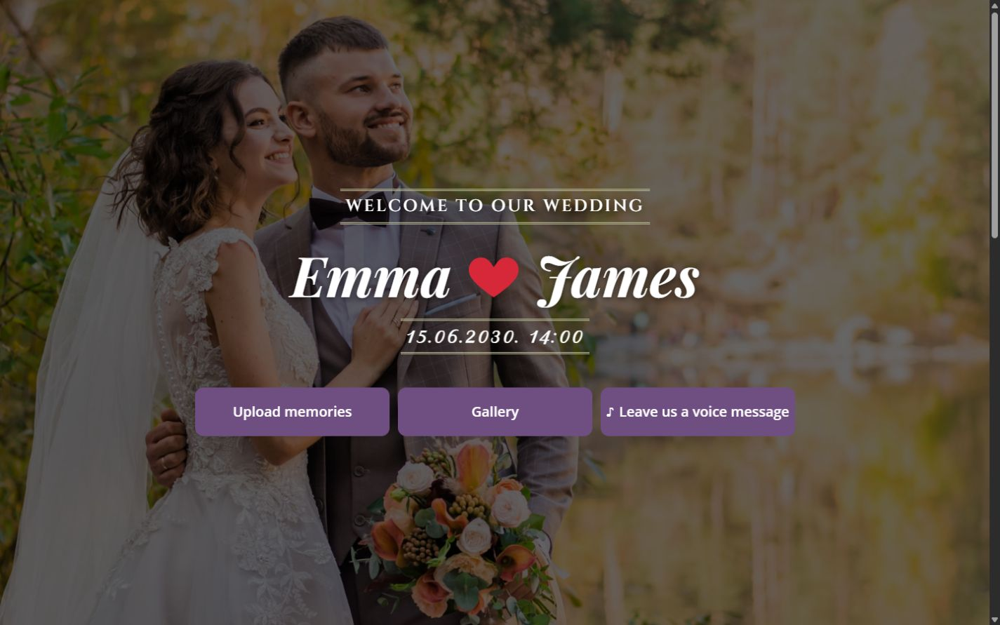
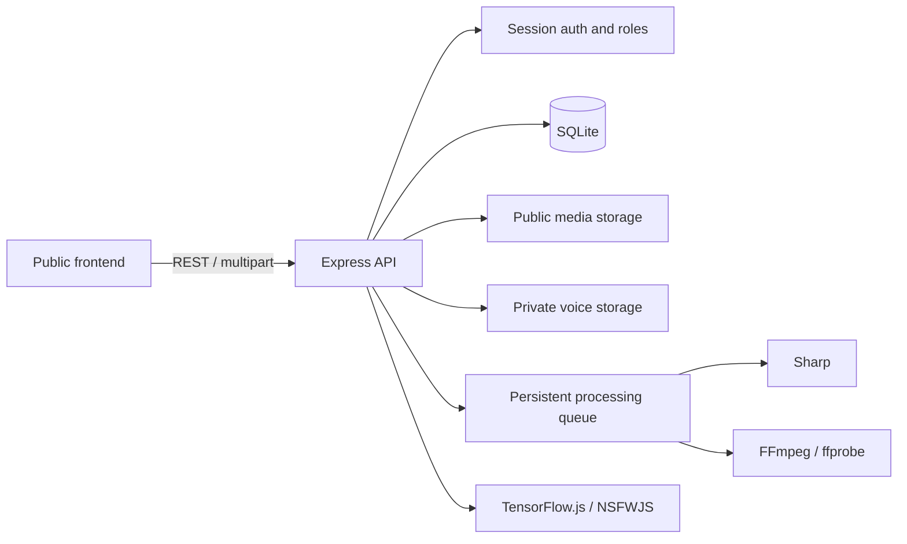

# Wedding Photo Sharing Platform

A self-hosted, multilingual wedding media platform for collecting guest photos, videos, and private voice messages. It combines a static browser experience with a TypeScript/Express API, SQLite persistence, background media processing, moderation, and role-based administration.

> This repository contains generic demo content. Configure your own names, event schedule, domain, retention policy, and branding before deployment.

## Features

### Guest experience

- Serbian, English, and German localization with a language selector
- Server-driven event schedule and server-side event lock
- Countdown driven by `WEDDING_AT`
- Photo/video upload progress and responsive gallery
- Infinite scrolling, GLightbox image viewing, Plyr video playback, likes, and original downloads
- Browser voice recording with preview, re-record, and upload progress

### Media and moderation

- Sharp image rotation, resizing, thumbnails, and web output
- FFmpeg/ffprobe video validation, thumbnails, and browser-friendly output
- TensorFlow.js and NSFWJS image moderation with manual review fallback
- Admin approve, hide, delete, statistics, and separate photo/video ZIP exports

### Private voice messages

- MediaRecorder capture in the browser
- Private Multer storage outside public uploads
- Signature checks, ffprobe metadata checks, decode validation, and AAC/M4A normalization
- Couple-only listing, byte-range streaming, listened status, individual/ZIP download, and deletion

### Reliability and security

- Persistent SQLite processing queue with atomic claims, retry, stale-job recovery, and manual video retry
- bcrypt password hashing and `admin` / `couple` roles
- SQLite-backed sessions with secure production cookies
- Trusted-origin checks, rate limiting, file validation, server-side lock enforcement, and graceful shutdown

## Screenshots / Demo

The screenshots below use the bundled generic demo content, the fictional couple Emma & James, and a non-production event date.



Additional screenshots: [gallery](docs/screenshots/gallery-desktop.png), [photo viewer](docs/screenshots/photo-viewer.png), [voice-message dialog](docs/screenshots/voice-message.png), [mobile landing page](docs/screenshots/mobile-home.png), and [mobile gallery](docs/screenshots/mobile-gallery.png).

## Architecture


```mermaid
flowchart LR
    Browser[Public frontend] -->|REST / multipart| API[Express API]
    API --> Auth[Session auth and roles]
    API --> DB[(SQLite)]
    API --> Files[Public media storage]
    API --> Private[Private voice storage]
    API --> Queue[Persistent processing queue]
    Queue --> Sharp[Sharp]
    Queue --> FFmpeg[FFmpeg / ffprobe]
    API --> AI[TensorFlow.js / NSFWJS]
```

See [Architecture](docs/ARCHITECTURE.md) for component and data-flow details.

## Tech stack

- Node.js 22, TypeScript, Express
- SQLite through `better-sqlite3`
- Sharp, FFmpeg, and ffprobe
- TensorFlow.js (`@tensorflow/tfjs-node`) and NSFWJS
- bcrypt, express-session, express-rate-limit, Multer, Archiver
- Bootstrap, GLightbox, Plyr, MediaRecorder API, and vanilla JavaScript

## Requirements

- Node.js 22 and npm
- FFmpeg and ffprobe available on `PATH`
- A writable data location and a separate absolute directory for private voice messages
- A local `mail` command if notification delivery is enabled by the host
- Linux is recommended for production; Nginx and systemd are optional but documented

## Quick start

```bash
git clone https://github.com/your-username/wedding-photo-sharing-platform.git
cd wedding-photo-sharing-platform/backend
cp .env.example .env
npm ci
npm run build
npm start
```

Open `http://localhost:3000`. The backend serves the frontend and creates empty SQLite/runtime storage on first start. Never commit `.env`, databases, sessions, or uploaded media.

For complete setup, native dependency notes, and Windows/Linux differences, see [Installation](docs/INSTALLATION.md).

## Configuration

All production values are environment-driven. The canonical template is [`backend/.env.example`](backend/.env.example). Dates must be ISO 8601 timestamps with explicit offsets, for example `2030-06-15T08:00:00+02:00`.

| Variable | Required | Purpose |
| --- | --- | --- |
| `NODE_ENV` | Recommended | Use `production` behind HTTPS. |
| `PORT` | No | HTTP port; defaults to `3000`. |
| `ALLOWED_ORIGINS` | Production | Comma-separated browser origins allowed by CORS. |
| `SESSION_SECRET` | Yes | Random session secret, at least 32 characters. |
| `DEFAULT_ADMIN_USERNAME` | Optional pair | Bootstrap username when paired with a strong default password. |
| `DEFAULT_ADMIN_PASSWORD` | Optional pair | Bootstrap password; remove after creating managed users. |
| `EVENT_UNLOCK_AT` | Yes | Server-side guest feature unlock time. |
| `WEDDING_AT` | Yes | Countdown/event time; must follow unlock time. |
| `ADMIN_EMAIL` | Yes | Pending-review notification recipient. |
| `ADMIN_PANEL_URL` | Yes | Generic/public admin panel URL used in mail. |
| `COUPLE_NOTIFICATION_EMAIL` | Yes | Voice-message notification recipient. |
| `COUPLE_PANEL_URL` | Yes | Couple panel URL used in mail. |
| `VOICE_MESSAGES_DIR` | Yes | Absolute private path outside public uploads. |

See [Configuration](docs/CONFIGURATION.md) for examples and security notes.

## Creating users

Start the application once so database migrations run, then use the interactive CLI. Passwords are prompted without accepting them as command-line arguments.

```bash
npm run create-user -- --username=site-admin --role=admin
npm run create-user -- --username=the-couple --role=couple
```

## Event lock

`GET /api/event-config` exposes only the configured timestamps required by the frontend. Uploads, gallery access, and guest voice-message submission are enforced by the backend against `EVENT_UNLOCK_AT`; hiding a button is not treated as security.

## Processing and moderation

Images are validated, normalized, resized, and moderated. Videos and voice messages are processed through persistent `processing_jobs` records so queued work survives restarts. Failed video jobs can be retried from the admin interface. AI moderation is an aid, not a guarantee; operators remain responsible for review.

- [Photo/video processing and queue](docs/PROCESSING_QUEUE.md)
- [Private voice messages](docs/VOICE_MESSAGES.md)

## Tests

```bash
cd backend
npm test
```

The suite covers event locking, likes, processing queue behavior, video retry/recovery, and voice-message authorization/upload/stream/delete flows. Tests isolate runtime data through `TEST_DATA_ROOT`. See [Testing](docs/TESTING.md).

## Production deployment

Generic Ubuntu, Nginx, and systemd examples are provided in [Deployment](docs/DEPLOYMENT.md), [`deploy/nginx.example.conf`](deploy/nginx.example.conf), and [`deploy/wedding-backend.service.example`](deploy/wedding-backend.service.example). Replace `example.com`, paths, users, secrets, and retention settings.

## Security

Keep secrets outside Git, use HTTPS, restrict private storage, validate proxy/origin settings, patch dependencies deliberately, and review uploads and retention requirements. See [Security policy](docs/SECURITY.md) and [Backup and recovery](docs/BACKUP_AND_RECOVERY.md).

## Project structure

```text
backend/                TypeScript API, queue, processors, CLI, tests
frontend/               Static multilingual UI and vendored browser libraries
docs/                   Architecture, operations, security, and feature guides
deploy/                 Generic Nginx and systemd examples
.github/                Issue and pull-request templates
uploads/                Empty tracked placeholders; runtime content is ignored
```

## Contributing

Contributions are welcome. Read [CONTRIBUTING.md](CONTRIBUTING.md), never include private event data or runtime files, and run the build and test suite before opening a pull request.

## License

Original project code is licensed under the [MIT License](LICENSE). Vendored libraries and assets may carry separate terms; see [Third-party notices](THIRD_PARTY_NOTICES.md).

## Disclaimer

This is self-hosted software. The operator is responsible for consent, privacy notices, moderation, access control, backups, data retention, and compliance with applicable local laws.
