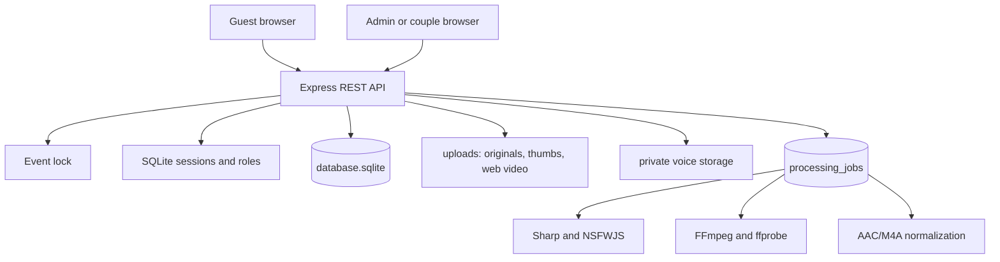

# Architecture

## Runtime overview

The Express process serves the static frontend and API. SQLite stores media metadata, likes, users, voice-message metadata, and persistent processing jobs. Sessions use a separate SQLite database. Public photo/video derivatives live below `uploads`; voice messages must live at an absolute path outside that tree.

## Request paths

- Public requests read event configuration, submit media, page through the gallery, like entries, and download originals.
- Admin requests require an authenticated `admin` role for statistics, moderation, deletion, retry, and ZIP exports.
- Couple requests require a `couple` role for private voice listing, range streaming, listened state, downloads, ZIP export, and deletion.

## Media flows

Images are validated, rotated and resized with Sharp, then classified with NSFWJS. Videos are accepted into original storage and normalized asynchronously. Voice uploads enter private storage, are signature/probe/decode validated, recorded in SQLite, and normalized asynchronously to M4A.

## Worker and shutdown

`processing_jobs` is the durable queue. A worker atomically claims one ready job at a time, retries transient failures with delays, recovers stale work after restart, and records terminal errors. On SIGINT/SIGTERM the HTTP listener stops accepting traffic, the worker drains/stops, sessions and databases close, and the process exits.

## Trust boundaries

The browser is untrusted. Event lock, authentication, authorization, file identity, storage paths, and processing state are enforced by the backend. Nginx is an optional TLS/reverse-proxy boundary; it must never expose private voice storage.
