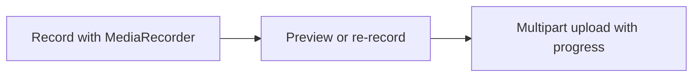
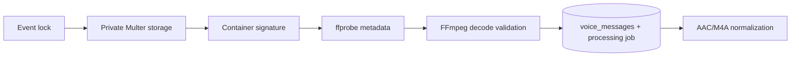

# Private voice messages

## Guest flow

The browser limits recording duration, lets the guest enter a neutral sender label, previews the captured Blob, and submits it only after confirmation. The backend remains authoritative for event lock and validation.

## Backend flow

Incoming names are random and do not trust client filenames. Voice storage must be an absolute path outside public uploads. Validation rejects missing audio, embedded video, unsupported channels/rates, invalid duration, empty data, and undecodable content. Normalization creates mono 48 kHz AAC/M4A output and strips metadata.

## Couple flow

Only authenticated `couple` users can list messages and statistics, stream with HTTP byte ranges, mark listened status, download one message, export a ZIP, or delete messages. Deletion removes database/queue state and relevant files. There is no direct static route to private storage.

## Privacy

Voice recordings are personal data. Publish a clear consent/retention policy, restrict administrators, encrypt backups, avoid public filenames, and delete data when it is no longer needed.
